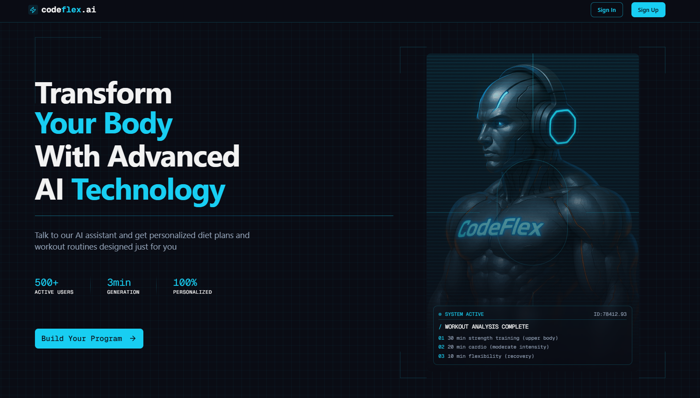
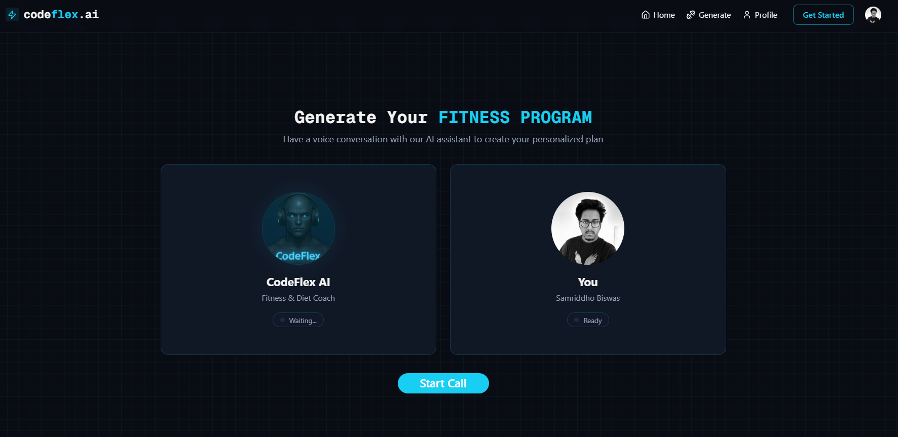

<h1 align="center">💪 CodeFlex - AI Fitness Assistant 🤖</h1>

A smart, voice-enabled AI-powered fitness app that helps users achieve their health goals through personalized workout and diet programs.



---

## 🚀 Highlights

- ⚙️ Built with **Next.js**, **React**, **Tailwind CSS**, and **Shadcn UI**
- 🎙️ Voice AI Assistant powered by **Vapi**
- 🧠 LLM integration with **Gemini AI**
- 🏋️ Personalized Workout Plans
- 🥗 AI-generated Diet Recommendations
- 🔒 Authentication & Authorization with **Clerk**
- 💾 Real-time Data Storage using **Convex**
- 📱 Fully Responsive Design optimized for all devices

---



---

## 📄 Features
- 🧠 **Smart AI Assistant**  
  Talk to your AI assistant that listens, understands, and responds based on your fitness goals and current health conditions.
- 🏋️ **Workout & 🥗 Diet Plans**  
  Generates real-time, AI-curated workout and diet plans tailored to your needs and preferences.
- 🔐 **User Auth with Clerk**  
  Easily sign up or log in with GitHub, Google, or Email/Password. Only authenticated users can create or access fitness programs.
- 🎬 **Program Management**  
  Create multiple fitness programs. Automatically marks the latest one as active while preserving old ones for reference.


---

## 🔐 .env Setup

Create a `.env.local` file in the root directory and add the following (update with your credentials):

```
NEXT_PUBLIC_CLERK_PUBLISHABLE_KEY=<your_clerk_publishable_key>
CLERK_SECRET_KEY=<your_clerk_secret_key>

VAPI_API_KEY=<your_vapi_api_key>
GEMINI_API_KEY=<your_gemini_api_key>

CONVEX_DEPLOYMENT_NAME=<your_convex_deployment_name>
```

---

## 🧑‍💻 Getting Started

### 1. Clone the Repository

```
git clone https://github.com/your-username/codeflex.git
cd codeflex
```

### 2. Install Dependencies

```
npm install
```

### 3. Run the Development Server

```
npm run dev
```

### 4. Start Convex Development Server

```
npx convex dev
```

> Ensure you have initialized Convex in your project using:
> ```
> npx convex init
> ```

Visit `http://localhost:3000` to view the app in your browser.

---

## 📦 Project Structure

```
codeflex/
│
├── public/                 # Static assets (images, demo gifs, etc.)
├── src/                    # Source code
│   ├── app/                # Next.js app directory (routes, layouts, pages)
│   ├── components/         # Reusable UI components
│   ├── constants/          # Constants used throughout the app
│   ├── lib/                # Utility functions and API clients
│   ├── providers/          # Context providers (e.g., theme, auth)
│   └── middleware.ts       # Middleware logic for auth or routing
│
├── convex/                 # Convex backend functions and schema
├── .env.local              # Local environment variables
├── .gitignore              # Git ignored files list
├── components.json         # Shadcn UI component config
├── eslint.config.mjs       # ESLint configuration
├── next-env.d.ts           # TypeScript Next.js environment declarations
├── next.config.ts          # Next.js configuration
├── package.json            # Project metadata and dependencies
├── package-lock.json       # Dependency lock file
├── postcss.config.mjs      # PostCSS configuration
├── tailwind.config.ts      # Tailwind CSS configuration
├── tsconfig.json           # TypeScript compiler configuration
└── README.md               # Project documentation

```

---

## 📄 License

This project is licensed under the MIT License.

---

